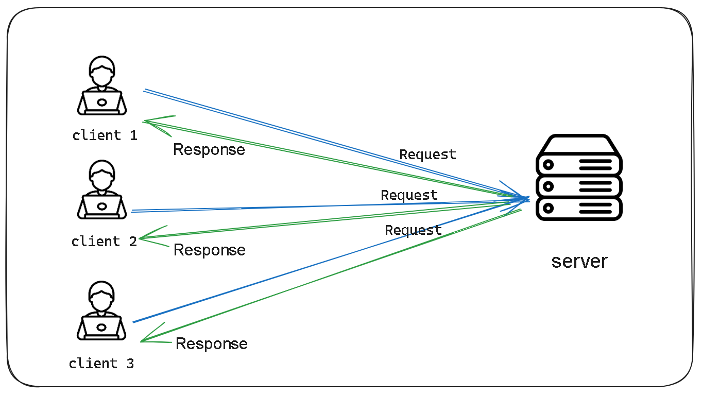
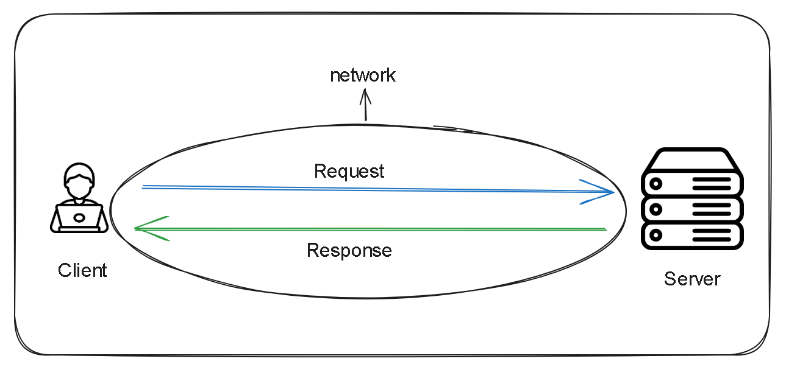

# Exploring the World of Servers
 
 A server is a computer that provides services to the clients.  
 A client is a computer that requests for services from the client.  
 From the above definitions it is worthwhile to note that the two are all computers and what distinguishes one from another is the role it plays. In essence the server and the client are all computers with all the necessary features of a typical computer: RAM, HDD, System bus, an installed operating system and application programs to mention but a few. 

The client and the server both communicate through a network which is the medium that facilitates their interaction. In this lesson we will ignore the network aspect.  

[CGI Versus FastCGI versus WSGI](https://www.sobyte.net/post/2021-11/cgi-fastcgi-wsgi/)     
[PEP-3333 - WSGI official docs](https://peps.python.org/pep-3333/#specification-details)    
[How CGI Works](https://computer.howstuffworks.com/cgi.htm)     
[Youtube (PowerCert Animated Videos)- What is A server](https://www.youtube.com/watch?v=UjCDWCeHCzY)    
[What is WSGI -wsgi.readthedocs.io](https://wsgi.readthedocs.io/en/latest/what.html)    
[WSGI - introduction](https://wsgi.tutorial.codepoint.net/intro)   

icons   
[Illustrations Courtesy of Excalidraw](https://excalidraw.com/)     
<a href="https://www.flaticon.com/free-icons/server" title="server icons">Server icons created by Pixel perfect - Flaticon</a>  
<a href="https://www.flaticon.com/free-icons/computer" title="computer icons">Computer icons created by juicy_fish - Flaticon</a>
