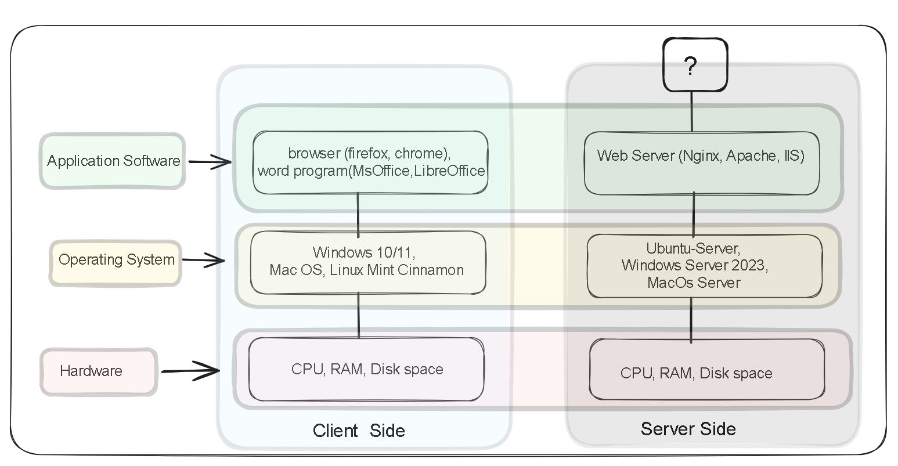
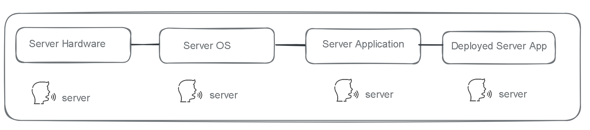

# Exploring the World of Servers
   

 A server is a computer that provides services to the clients.  
 A client is a computer that requests for services from the client.  
 From the above definitions it is worthwhile to note that the two are all computers and what distinguishes one from another is the role it plays. In essence the server and the client are all computers with all the necessary features of a typical computer: RAM, HDD, System bus, an installed operating system and application programs to mention but a few. 

The client and the server both communicate through a network which is the medium that facilitates their interaction. In this and forthcoming lesson we will ignore the network aspect.  

##  The Client Server Architecture 
> The client Server Architecture is a computing formation in which a computer (client) or computers (clients)  rely on another computer (server) for services   
    - wikipedia     

The services may include:   
- The client requesting for information from the server i.e Retrieving a webpage, Downloading a file    
- Request for processing of data - validation during creation of an account
- Request to send a message t another client. i.e email
The above mentioned are just a few instances where the servers services. 

## Comparing Clients and Servers. 
    
From the diagram above you can clearly see tha client and the server have a few similarities in architecture from Hardware up to the application layer. 

From the server side we have left a question mark on top of the application layer. This is where the server side applications we develop and deploy will live.     
The server and the client though being similar in architecture should have a few differences owing to the fact that the play different roles in the Client Server architecture.     

A server as it's meant to provide services should beat the client in a few computing metrics. listed below are some of them.    
- High Performance Computing (optimizations)
- Reliability and fault tolerance
- Security
- Compatibility and interoperability
- Concurrency Support
- Speed 

### Essentially, What is a Server?
On the Client side the term program/software is usually used to refer to any application  that is installed on top of the operating system, While the operating System is usually distinguishable as the layer that sits between the hardware and the application software. 
On the server side the term Server is usually used to refer to everything from the Hardware layer up to the deployed application layer.  
    
This usually brings a lot of confusion especially to individuals who are new to the server side. A way of situating whatever aspect of the server is being referred to is to use the current context and the examples being used as a basis.    

For our learning we will be majorly focusing on the deployed app, although we will also cover the server application side in the next lesson so as to have a better picture of the interaction between the two. 

### Sources
[Client Server Model - Wikipedia](https://en.wikipedia.org/wiki/Client%E2%80%93server_model)    
[What is Client Server Architecture- simplilearn ](https://www.simplilearn.com/what-is-client-server-architecture-article#:~:text=The%20client%2Dserver%20architecture%20refers,model%20or%20client%20server%20network.)  
[What is The Client-Server Architecture - Cyber Talents](https://cybertalents.com/blog/client-server-architecture)  
  

icons and other Resources.  
[Illustrations made on Excalidraw](https://excalidraw.com/)     
<a href="https://www.flaticon.com/free-icons/server" title="server icons">Server icons created by Pixel perfect - Flaticon</a>  
<a href="https://www.flaticon.com/free-icons/computer" title="computer icons">Computer icons created by juicy_fish - Flaticon</a>   
<a href="https://www.flaticon.com/free-icons/speak" title="speak icons">Speak icons created by Mayor Icons - Flaticon</a>   

